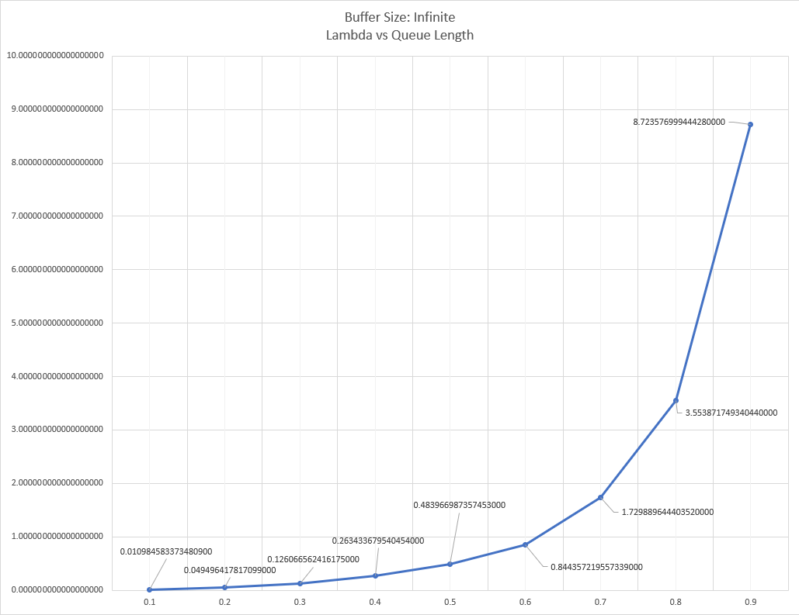
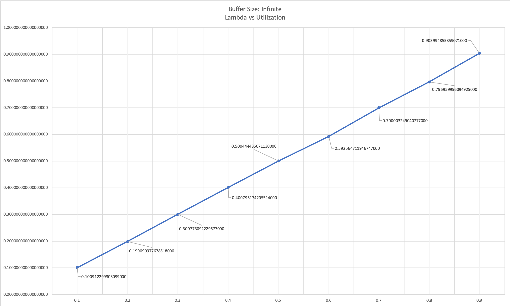
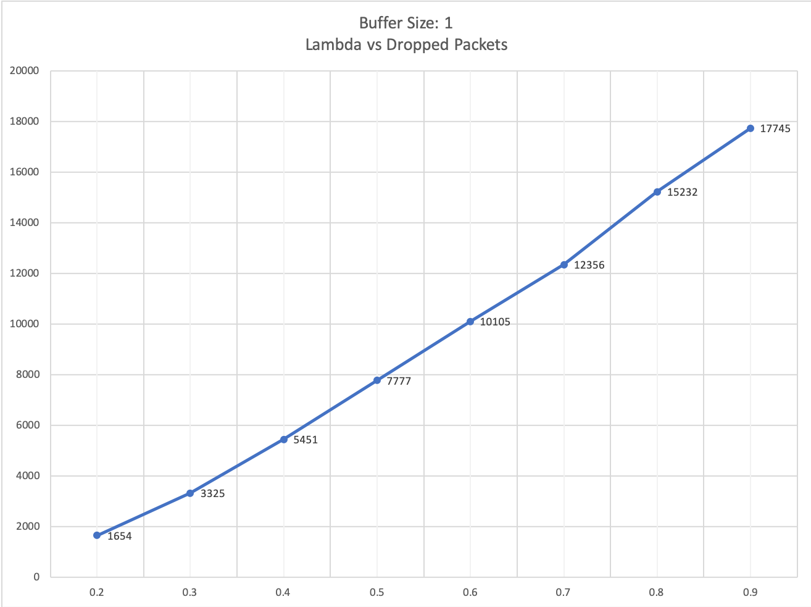
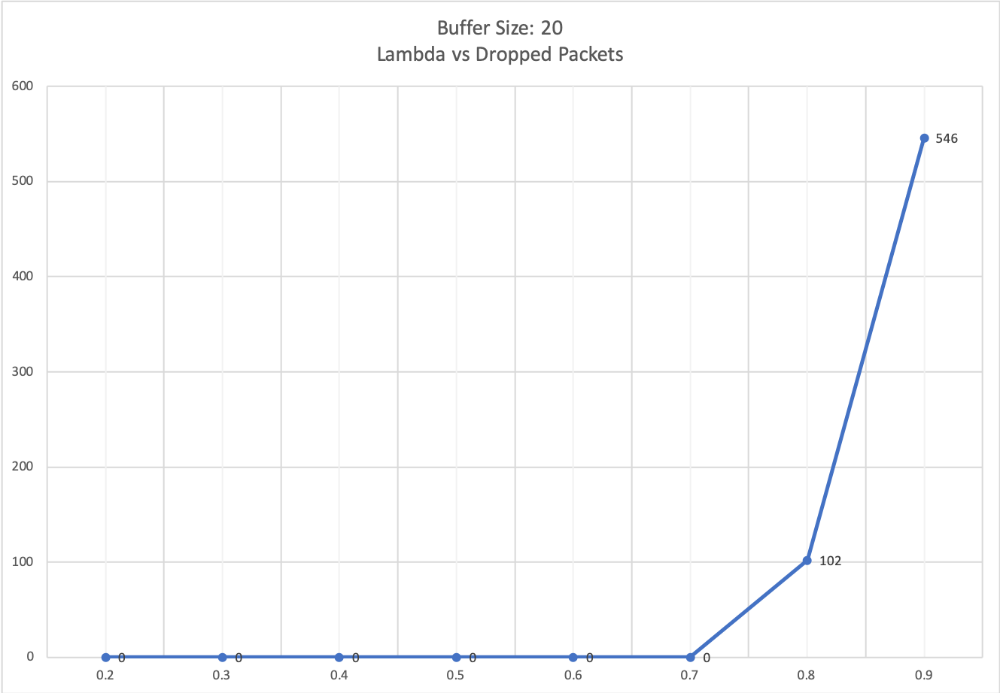
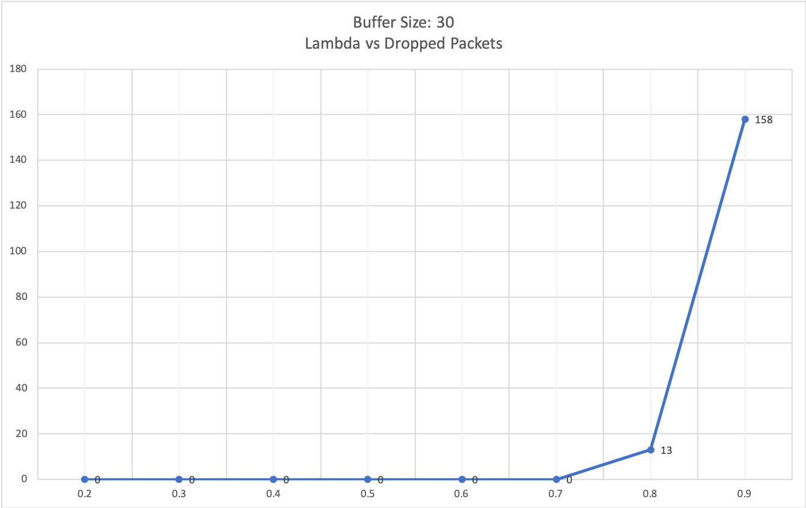
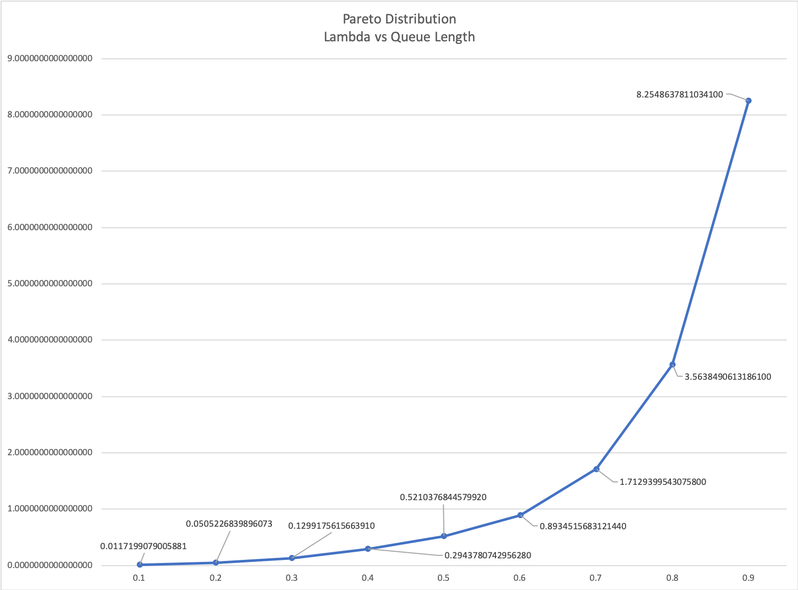
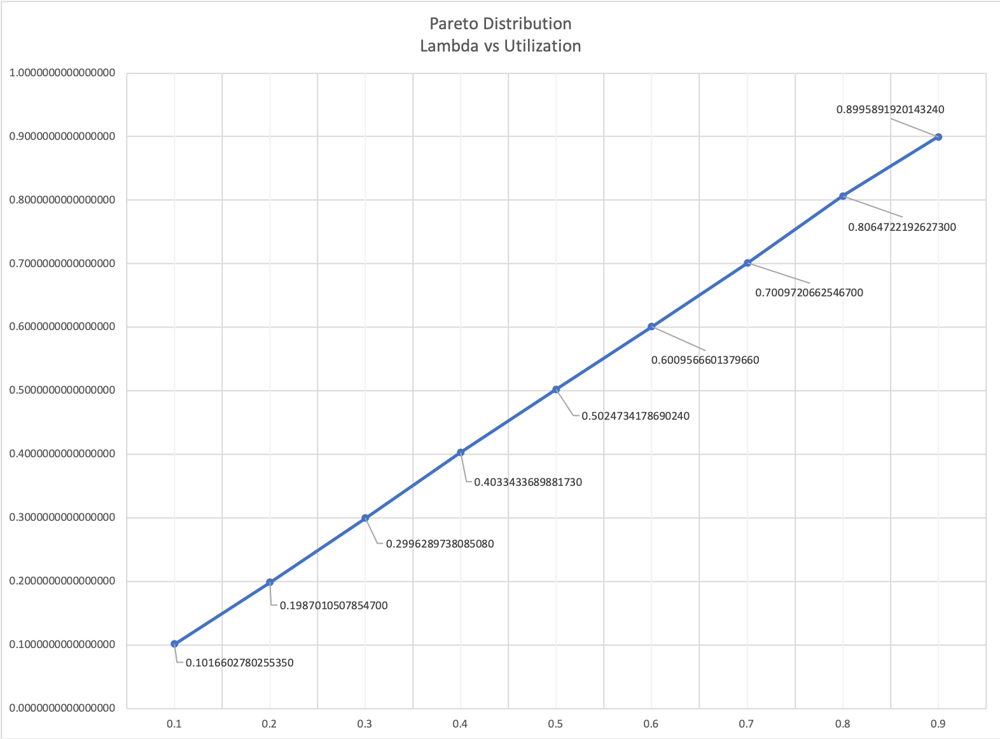
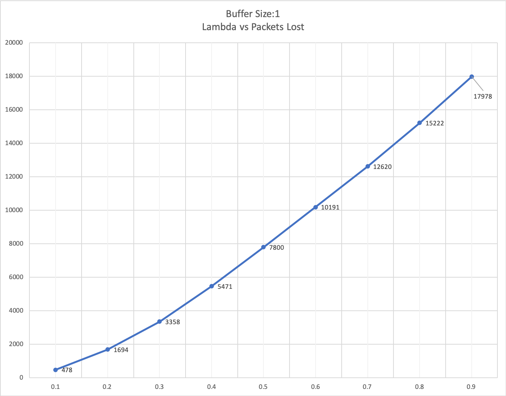
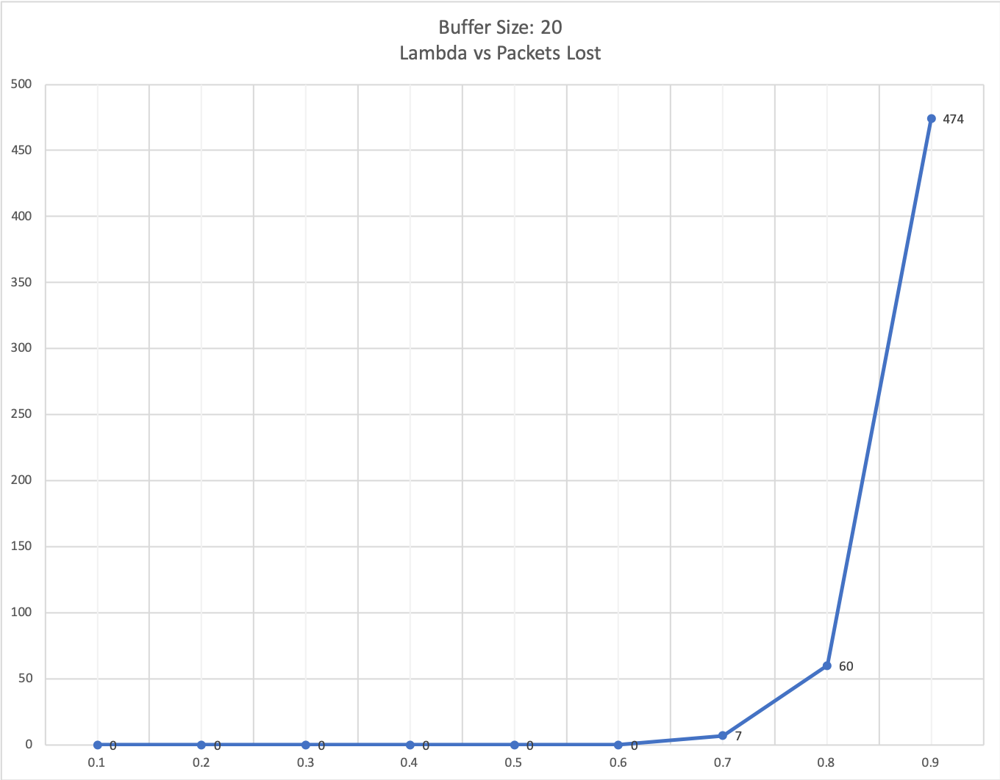
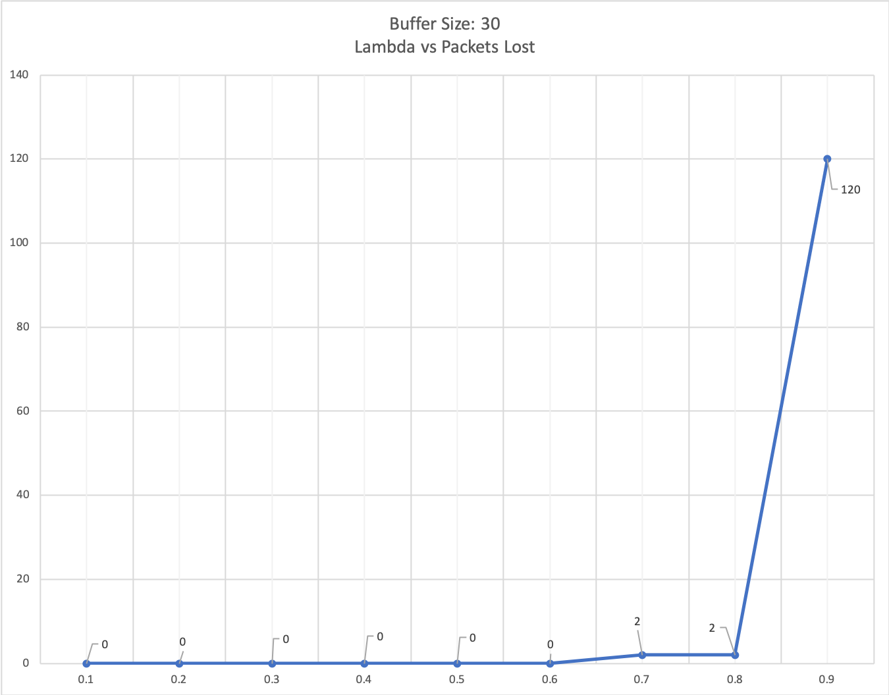

# Project 1 Report

**Team Members**: Lei Zuo,
Josue Aleman,
Sattar Ehtesham
## **Introduction**
In this project we wanted to simulate the behavior of the transmission of packets. We specifically wanted to measure the utilization (how often the server was busy), the mean queue length and how many packets were dropped due to buffer overflow. 

**Language used**: For this project we decided to use `Python` as our programming language. The reason we chose Python is because of its versatility and there was less overhead in implementing some of the data structures required. For our plotting, we decided to use the `Excel`  because of its intuitiveness and customizability that was needed to plot. 

### **Data Structures Implemented**:
1. `Event` class which holds the previous, next, time and type. This is the smallest unit used in the Doubly linked list. When instantiated, it allows us to easily keep track of every event and perform the operations required in the Global Event List (GEL).
2. Doubly Linked List (`DLL`) is the container type that will simulate the Global Event List, allowing for insertion in the middle of the list, and the other basic operations required such as removing the first element of the list. 
3. `Packet` class is the smallest unit used in the Buffer container which holds the service time. 
4. `Buffer` class is a queue container that stores non-processed packets. It has basic operations such as insert and remove in a FIFO order. 

### **Variables used**:
1. `flag`: it records if the user wants to simulate the negative exponential distribution (regular mode) or the Pareto distribution (extra credit mode)
2. `buffer_size`: user defined, determines the size of the buffer from 1-infinity, user must use ‘i’ for infinity
3. `arrival_rate`: user defined, this is **λ**(inter-arrival rate)
4. `service_rate`: user defined, this is **μ** (transmission rate)
5. `time`: variable that holds the current time
6. `busy_time`: keeps a running total of the times the server is busy 
7. `packets_dropped`: keeps a count of the number of packets dropped
8. `GEL`: is an instance of the doubly linked list (`DLL`)
9. `buffer`: instance of the Buffer class
10. `length`: number of packets currently in the queue
11. `get_busy_time`: keeps a record of the last time the server changed from idle to busy
12. `busy`: boolean that determines if server is idle or busy
13. `queue_length_areas`: keeps the sum of the area under the curve for the time vs queuelength graph

### **Functions used**:
1. `nedt`:
params:  rate- the arrival rate or transmission rate
Generates the negative exponential distribution time based on the rate (**λ** or **μ**) passed to it.

2. `pareto`:
params: rate- arrival rate or transmission rate
Generates the Pareto distribution time based on the rate (**λ** or **μ**) passed to it.

## **Implementation**
We are following the logic provided in section *3.2* and *3.3* and *3.4* of the project guidelines. 
**Collecting Statistics**: 
- For *utilization* we used the variable called `get_busy_time` which keeps a record of the last time the server changed from idle to busy, and when the server changed from `busy== True` to `busy== False` we add the difference between `time` and `get_busy_time` to `busy_time`. Once the simulation terminates, we divide `busy_time` by `time` to get the mean server utilization. 
- For *mean queue-length* we used `queue_length_areas` to keeps the sum of the area under the curve for the time vs queuelength graph. The way it does this is by adding the product of `event.time`  and `length -1` to `queue_length_areas`. The reason we use `length-1` is because the `length` already contains the transmitting packet. Once simulation ends, we find *mean queue-length* by dividing `queue_length_areas` by `time`. 
- To find the *number of packets dropped* we check the `length -1`  with the `buffer_size` and if `buffer_size` is equal or smaller, we increment `packets_dropped` by one.  

## **Running the script**:
In terminal type:

    python p1.py

This will run the script and will show a prompt (see `flag` variable for details on regular or extra credit):

    $ Regular or extra credit? (r/e): _

If **`"r"`** is selected then the next prompt will ask for the buffer size (see `buffer_size` variable for details on input): 

    $ Please enter the buffer size (type i for infinite buffer) : _

Once a buffer size is selected, other than **`"i"`** the following prompt will ask for the arrival rate (**λ**):

    $ Please enter the arrival rate (lambda) : _

Once arrival rate is determined, the following prompt will ask for the service rate (**μ**):

    $ Please enter the service rate (mu) : _

After entering the service rate and pressing `RETURN` the script will simulate the transmissions and return a summary of the results.

Example run:

    $ Regular or extra credit? (r/e): r
    $ Please enter the buffer size (type i for infinite buffer) : 20
    $ Please enter the arrival rate (lambda) : 0.5
    $ Please enter the service rate (mu) : 0.5
    ---------- Experiment result ----------
    Total time : 101986.60794659385
    Utilization : 0.9519069508419812
    Mean queue length : 10.301933970030367
    Lost packets : 2260
    ---------- End of the result ----------

## **Experiment Results**:
*Note*: We included the  λ values of 0.3 and 0.7 in our data to more accurately show the function curve.

1. 
    a. With a queue of infinite size below is the plot of the **queue-length** with various **λ's**.

    b. With a queue of infinite size, below is the plot of the **utilization** with various **λ's**.

2. a. **Mean queue-length equation**:  
   $\overline{Q} = \frac{(\frac{\lambda}{\mu})^2}{1 - \frac{\lambda}{\mu}}$

   μ = 1, λ = 0.1, queue-length = 0.0111  
   μ = 1, λ = 0.2, queue-length = 0.05  
   μ = 1, λ = 0.4, queue-length = 0.266666  
   μ = 1, λ = 0.5, queue-length = 0.5  
   μ = 1, λ = 0.6, queue-length = 0.9  
   μ = 1, λ = 0.8, queue-length = 3.2  
   μ = 1, λ = 0.9, queue-length = 8.1  

### Mean Queue Length Table
| Lambda | Expected | Actual             | Error (%) |
|:------:|---------:|-------------------:|:---------:|
| 0.1    | 0.0111   | 0.0109845833734809 | 1.14%     |
| 0.2    | 0.05     | 0.0109845833734809 | 1.02%     |
| 0.4    | .26666   | 0.2634336795404540 | 1.23%     |
| 0.5    | 0.5      | 0.4839669873574530 | 3.31%     |
| 0.6    | 0.9      | 0.8443572195573390 | 6.59%     |
| 0.8    | 3.2      | 3.5538717493404400 | 9.96%     |
| 0.9    | 8.1      | 8.7235769994442800 | 7.15%     |

   b. **Server Utilization equation**:

   $U_s= \frac{\lambda}{\mu}$

For this equation we set μ = 1, therefore:  
utilization = λ = 0.1  
utilization = λ = 0.2  
utilization = λ = 0.4  
utilization = λ = 0.5  
utilization = λ = 0.6  
utilization = λ = 0.8  
utilization = λ = 0.9  
### Server Utilization Table
| Expected | Actual             | Error (%) |
|:--------:|-------------------:|:---------:|
| 0.1      | 0.1009122993030990 | 0.90%     |
| 0.2      | 0.1999099977678510 | 0.05%     |
| 0.4      | 0.4007951742055140 | 0.20%     |
| 0.5      | 0.5004444350711300 | 0.09%     |
| 0.6      | 0.5925647119467470 | 1.25%     |
| 0.8      | 0.7969599960949250 | 0.38%     |
| 0.8      | 0.9039948553590710 | 0.44%     |
1. a. Plot of buffer with size 1

b. Plot with buffer size 20

c. Plot with buffer size 30

## **Conclusion**
Our simulation of the infinite queue, confirms the mean queue-length equation and the server utilization queation. We also simulated various buffer sizes, indicating that the smaller the buffer, the higher the number of packets dropped. With a buffer size of 1 and a fixed service rate of 1, we see that the packets dropped is linearly proportional to lambda. For buffer size of 20 and 30 we see that after a certain lambda threshold, the number of dropped packets increased significantly. 

----
## Extra Credit Pareto Distribution Experiment

**Sources**: [Pareto Query Arrivals](https://www.usenix.org/legacy/publications/library/proceedings/usenix03/tech/full_papers/roussopoulos/roussopoulos_html/node19.html)

### Approach
The specific distribution used is the Lomax distribution which is a special case of the Pareto distribution. For this distribution we set λ in each run so that $\frac{\alpha - 1}{\alpha}$ is equal to the rate, where α is the shape parameter. We let x be a random variable that can be generated with: 

$x = \lambda((1- u)^{-\frac{1}{\alpha}} - 1)$

Where *u* is the uniformly distributed random variable between 0 and 1. $\alpha$ is a given shape parameter. In this case we set $\alpha = 100$  that way the *Variance* is limited to a certain bound for our purpose. 

## Experiment Results

1. Below is the plot of a simulation with a queue of infinite size and **queue-length** with the various $\lambda$ rates:

### **Mean Queue Length Table**
*Note*: Our expected values for mean queue-length are the same as the ones we calculated in the main project.
| Lambda | Expected | Actual             | Error (%) |
|:------:|---------:|-------------------:|:---------:|
| 0.1    | 0.0111   | 0.0117199079005881 | 5.20%     |
| 0.2    | 0.05     | 0.0505226839896073 | 1.03%     |
| 0.4    | .26666   | 0.2943780742956280 | 9.41%     |
| 0.5    | 0.5      | 0.5210376844579920 | 4.04%     |
| 0.6    | 0.9      | 0.8934515683121440 | 0.73%     |
| 0.8    | 3.2      | 3.5638490613186100 | 10.21%    |
| 0.9    | 8.1      | 8.2548637811034100 | 1.88%     |

2. Below is the plot of the simulation and the **utilization** with the various $\lambda$ rates:

### **Server Utilization Table**
*Note*: Our expected values for server utilization are the same as the ones we calculated in the main project.
| Expected | Actual             | Error (%) |
|:--------:|-------------------:|:---------:|
| 0.1      | 0.1016602780255350 | 1.63%     |
| 0.2      | 0.1987010507854700 | 0.65%     |
| 0.4      | 0.4033433689881730 | 0.83%     |
| 0.5      | 0.5024734178690240 | 0.49%     |
| 0.6      | 0.6009566601379660 | 0.16%     |
| 0.8      | 0.8064722192627300 | 0.80%     |
| 0.8      | 0.8995891920143240 | 0.05%     |
----
### Plots With Buffer Sizes: 1, 20, 30

Buffer Size: 1

Buffer Size: 20

Buffer Size: 30

## Conclusion
After evalutating the Pareto distribution, the behavior of the queue system behaves very similar to the negative exponential queue system in our main project. This happens when $\alpha = 100$ and we noticed that when $1<\alpha<2$ the variance of the mean queue-length is unbounded, giving very unstable results. The larger $\alpha$ the more the result converges to the mean queue-length result we got in the negative exponential distribution. As for the utilization, we also see a linear correlation between $\lambda$ and the utilization for all $\alpha >1$. 